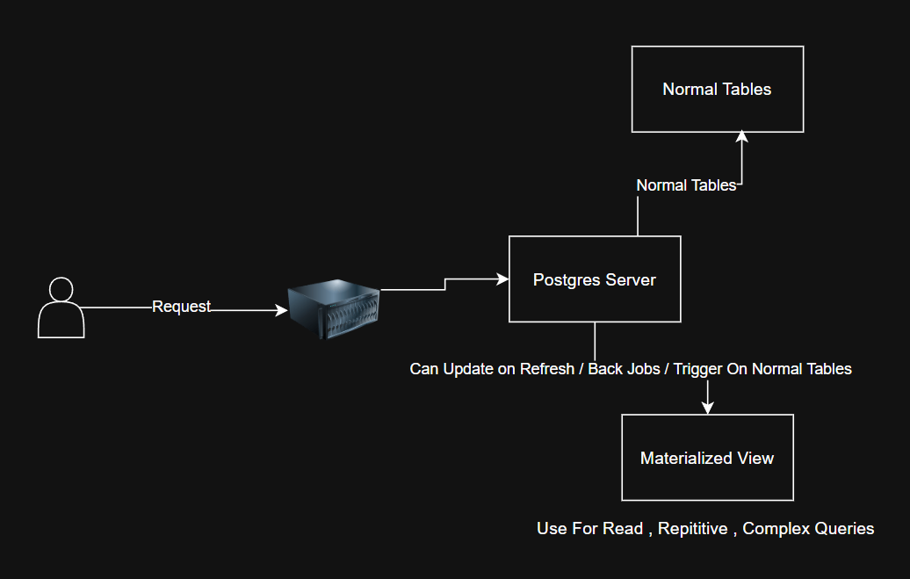

# Materialized View — Practical System Design Guide

## One-Line Summary

A Materialized View is a read-optimized, precomputed representation of expensive queries that is automatically maintained by the system when base data changes, and is used only for fast, repetitive reads — never as the source of truth.

---



## 1. WHAT (What is a Materialized View?)

A Materialized View (MV) stores the **result of a query physically**, like a table.

Instead of running heavy queries (JOINs, GROUP BY, aggregates) every time,
the system computes the result once and stores it for reuse.

It behaves like a normal table for reads.

---

## 2. WHY (Why Materialized Views exist)

Materialized Views exist because:

- Some queries are very expensive
- The same queries are executed repeatedly
- Joining large tables on every request is slow
- Cross-shard queries are painful

Truth:

> Databases are bad at repeatedly executing the same heavy computation.

Materialized Views trade:

- extra storage
- extra write complexity

for:

- much faster reads
- predictable performance

---

## 3. WHEN to Use a Materialized View (Very Important)

Use a Materialized View **ONLY IF**:

- The query is **read-heavy**
- The query is **repetitive**
- The query is **computationally expensive**
- Slight data staleness is acceptable

### Best candidates:

- Dashboards
- Analytics
- Aggregations (COUNT, SUM, AVG)
- Heavy JOINs
- Cross-shard summaries

### Do NOT use for:

- Simple primary-key lookups
- Real-time transactional flows
- Highly dynamic, ad-hoc queries

---

## 4. BASE TABLE vs MATERIALIZED VIEW (Core Concept)

| Aspect         | Base Tables     | Materialized View   |
| -------------- | --------------- | ------------------- |
| Purpose        | Source of truth | Fast reads          |
| Written by     | User APIs       | System only         |
| Data type      | Raw, detailed   | Derived, aggregated |
| Consistency    | Strong          | Eventual            |
| Can be rebuilt | No              | Yes                 |

**Base tables are never replaced.**

---

## 5. HOW Materialized Views are Updated (Critical)

Materialized Views do NOT update magically.

They are updated in **one of these ways**:

### Option A — Database-managed (less common at scale)

- Manual or scheduled `REFRESH MATERIALIZED VIEW`
- Database recomputes data

### Option B — Application-managed (most common)

- Base table changes
- System reacts using:
  - Background jobs
  - Events
  - Triggers
  - CDC pipelines
- Only affected rows are updated

Important:

> Users never update Materialized Views directly.

---

## 6. ACTUAL FLOW (User 42 Example)

### Step 1: User action

```

User 42 makes a payment

```

### Step 2: Write ONLY to base table

```sql
INSERT INTO payments(user_id, amount) VALUES (42, 500);
```

### Step 3: System reacts automatically

- Event emitted OR trigger fires OR worker runs

### Step 4: Materialized View updated (derived)

```text
UPDATE user_payment_stats
SET total_spent = total_spent + 500
WHERE user_id = 42;
```

### Step 5: Dashboard reads from MV

```sql
SELECT * FROM user_payment_stats WHERE user_id = 42;
```

User never touched the MV.
The system updated it as a reaction to base data changes.

---

## 7. REUSE (Your Big Doubt)

Once created, a Materialized View is **reused like a table**.

Multiple services can:

```sql
SELECT FROM materialized_view
```

Instead of:

```sql
JOIN + GROUP BY on base tables
```

This is why it improves performance.

---

## 8. DOES EVERYTHING GO INTO MATERIALIZED VIEWS?

❌ No.

Materialized Views are **surgical optimizations**, not default storage.

Rules:

- Writes → Base tables
- Heavy reads → Materialized Views
- Hot reads → Cache (Redis)

---

## 9. MATERIALIZED VIEW vs CACHE (High-Level)

| Aspect      | Materialized View  | Cache          |
| ----------- | ------------------ | -------------- |
| Purpose     | Reduce computation | Reduce latency |
| Data source | Database           | Memory         |
| Structure   | Structured (table) | Key-value      |
| Persistence | Yes                | No             |
| Rebuildable | Yes                | Yes            |

Big systems use **both**, not one.

---

## 10. WHAT MATERIALIZED VIEW IS NOT

❌ Not a replacement for database
❌ Not written by user APIs
❌ Not real-time guaranteed
❌ Not required from day one

It is an **optimization layer**.

---

## 11. FINAL MENTAL MODEL (Lock This)

```
User Actions
   ↓
Base Tables (Truth)
   ↓
System derives data
   ↓
Materialized View (Fast Read Model)
   ↓
APIs / Dashboards
```

And remember:

> Tables are written to.
> Materialized Views are read from.

---

## ONE-LINE TAKEAWAY

Materialized Views store precomputed results of heavy, repetitive queries and are automatically maintained by the system when base data changes, allowing fast and reusable reads without compromising data correctness.

```

```
