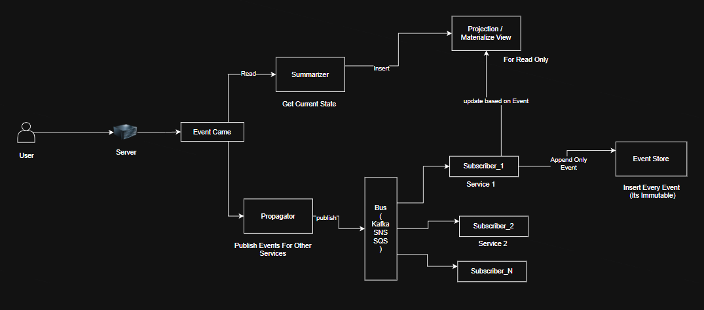

# Event Sourcing 

## One-Line Summary

Event Sourcing is a pattern where user actions are stored as immutable events in an append-only Event Store, and the current state is derived asynchronously through projections (materialized views), while other services independently react to the same events.

## 

## 1. WHAT (What is Event Sourcing?)

Traditional systems store only the **current state**:

```

balance = 500

```

Event Sourcing stores **what happened**:

```

MoneyDeposited(1000)
MoneyWithdrawn(500)

```

The current state is **not stored directly**.
It is **derived from events**.

---

## 2. CORE IDEA (Lock this)

> **Events are truth.  
> State is just a calculation.**

---

## 3. EVENT STORE (Your biggest doubt — cleared)

### ❓ What is Event Store?

✅ Event Store is usually a **normal database table**  
❌ But it does NOT behave like a normal CRUD table

### Rules:

- ❌ NO UPDATE
- ❌ NO DELETE
- ✅ ONLY INSERT (append-only)

### Typical schema:

```

## event_store

event_id
aggregate_type   (order, payment, account)
aggregate_id     (order_id, payment_id, user_id)
event_type       (PaymentFailed, OrderPaid)
event_data       (JSON)
version
timestamp

```

All domain events are stored here.
This is the **system of record**.

---

## 4. AGGREGATE (Very important)

Aggregate = entity whose **state evolution matters**

Examples:

- Order (created → paid → shipped → delivered)
- Payment (initiated → authorized → failed/success)
- Account (balance changes)

👉 Events are replayed **per aggregate**, not globally.

---

## 5. WRITE FLOW (Matches your diagram)

```

User Action
→ Command / API
→ Event created
→ Event appended to Event Store

```

Important:

- User writes ONLY events
- No projection is touched here
- No email / notification here

---

## 6. PROPAGATOR (Your diagram: ✔️ correct)

### Propagator does:

- Reads newly appended events
- Publishes them to the Bus

### Propagator does NOT:

- Apply business logic
- Update projections

Think:

> **Courier — not decision maker**

---

## 7. BUS (Kafka / SNS / SQS / etc.)

### Bus is “dumb” by design

It:

- Forwards events
- Handles delivery
- Knows nothing about meaning

Examples:

- Kafka
- RabbitMQ
- AWS SNS + SQS

❗ Kafka is **NOT** the Event Store  
Kafka is **only for propagation**

---

## 8. SUBSCRIBERS (Your diagram: ✔️ correct)

Subscribers are **independent services / workers**.

Examples:

- Projection updater (Summarizer)
- Email service
- Notification service
- Analytics
- Audit

All receive the **same event**.

---

## 9. SUMMARIZER / PROJECTION SERVICE (Major confusion resolved)

### ❓ What does Summarizer do?

Summarizer:

- Consumes events
- Updates **projection / materialized view**
- Stores **current state**

Example projection table:

```

## account_projection

user_id
balance

```

Summarizer logic:

```

MoneyDeposited → balance += amount
MoneyWithdrawn → balance -= amount

```

❌ Summarizer never touches Event Store  
❌ Summarizer never handles user commands  
✅ Only updates read models

---

## 10. PROJECTION / MATERIALIZED VIEW

Projection:

- Is a **normal DB table**
- Stores current state
- Is optimized for reads

Properties:

- Mutable (INSERT / UPDATE)
- Can be dropped & rebuilt
- NOT source of truth

Reads always go here:

```

SELECT balance FROM account_projection WHERE user_id = A;

```

---

## 11. REPLAY (Your confusion — fully cleared)

### ❓ What is replay?

Replay means:

- Reading events again from **Event Store**
- Applying business logic again
- Rebuilding projections or understanding history

Example:

```

MoneyDeposited(1000)
MoneyWithdrawn(500)

```

Replay result:

```

balance = 500

```

### ❗ Replay is NOT done via Kafka

Replay reads **directly from Event Store**

Kafka is only for real-time flow.

---

## 12. WHEN does replay happen?

Replay happens ONLY when:

- Projection is corrupted
- New projection logic added
- Bug fixed
- New read model introduced
- Debugging / audit required

❌ Not on every user request

---

## 13. WHY Event Sourcing is used (Final clarity)

Primary reasons:

- ✅ Correctness
- ✅ Full history
- ✅ Audit & compliance
- ✅ Replay & recovery

Secondary effects:

- Better scalability
- Async processing
- Decoupled services

❌ Not chosen just for performance  
❌ Not chosen just for security

---

## 14. EVENT STORE vs PROJECTION (Lock this forever)

| Aspect          | Event Store    | Projection    |
| --------------- | -------------- | ------------- |
| Stores          | Events (facts) | Current state |
| Mutable         | ❌ No          | ✅ Yes        |
| Source of truth | ✅ Yes         | ❌ No         |
| Used for reads  | ❌ Rare        | ✅ Always     |
| Can rebuild     | ❌ No          | ✅ Yes        |

---

## 15. FINAL MENTAL MODEL (Matches your diagram)

```

User
→ Event
→ Event Store (truth)
→ Propagator
→ Bus
→ Subscribers
├─ Summarizer → Projection (read-only)
├─ Email Service
├─ Notification Service
└─ Analytics / Audit

```

And remember:

> **One service decides what happened.  
> Many services react to what happened.**

---

## ONE-LINE TAKEAWAY

Event Sourcing stores immutable events as the source of truth, uses asynchronous propagation to update projections and trigger side effects, and enables replayability and correctness in complex domains.

```

```
