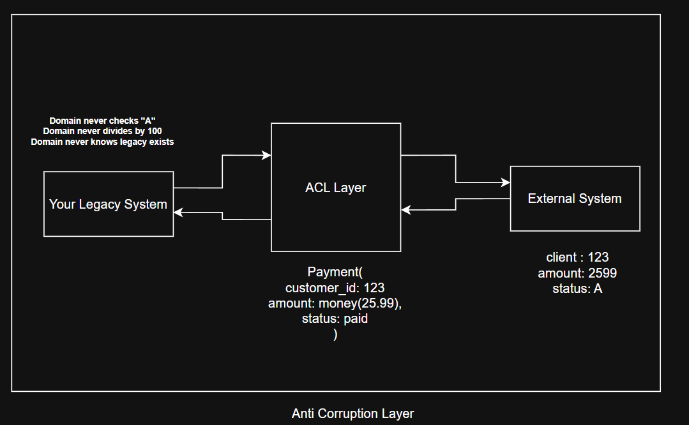

# 📘 Anti-Corruption Layer (ACL)

## 🔹 One-Line Intuition (lock this first)

> **Anti-Corruption Layer = external systems are never allowed to talk directly to your domain; their responses are translated first, then used.**

This pattern was described in Domain-Driven Design by **Eric Evans**.


---

## 1️⃣ WHY (why this pattern exists)

### Real production reality

Your system almost never lives alone.
It must integrate with:

- legacy systems
- third-party APIs
- vendor services
- old databases

These systems often have:

- bad naming
- weird status codes
- incorrect data types
- outdated assumptions

If you consume them **directly**, their problems slowly **infect your system**.

That infection is called **domain corruption**.

Once corruption spreads:

- refactoring becomes impossible
- domain model becomes ugly
- legacy mistakes become permanent

ACL exists to **stop that infection at the boundary**.

## 
---

## 2️⃣ WHAT (exact definition)

**Anti-Corruption Layer** is:

- a **facade / adapter / translator**
- placed **between your system and an external system**
- that:

  - translates data
  - converts meanings
  - hides external quirks

- so your internal domain remains clean

It is **not about performance**.
It is **about protecting meaning**.

---

## 3️⃣ CORE IDEA (this answers your main doubt)

> **External system response NEVER enters your system directly.
> It ALWAYS passes through the Anti-Corruption Layer first.**

Only after translation does your system use it.

---

## 4️⃣ FLOW (visual + mental model)

```
External System
   |
   |  raw / ugly response
   v
[ Anti-Corruption Layer ]
   |
   |  clean, translated objects
   v
Your Domain Logic
```

🔥 Your domain never sees:

- raw JSON
- legacy field names
- magic codes
- strange data formats

---

## 5️⃣ IMPORTANT CLARIFICATION (your “middle server” doubt)

You said:

> “middle server jo response filter karega”

Here is the **precise correction** 👇

### ✅ ACL is usually NOT a separate server

Most of the time:

- ACL is **just a code layer**
- inside the **same service**
- no extra network hop

```
Your Service
 ├─ Domain
 ├─ Anti-Corruption Layer
 └─ External API Client
```

### ❗ ACL as a separate service is OPTIONAL

Used only when:

- many systems depend on same legacy
- heavy translation logic
- long migration (Strangler Fig)

---

## 6️⃣ FILTER vs TRANSLATE (very important)

### ❌ ACL is NOT just filtering

Filtering:

- removing fields
- changing format

### ✅ ACL is TRANSLATION

Translation means:

- changing **meaning**
- mapping concepts

Example:

- `"A"` → `PaymentStatus.PAID`
- `"2599"` → `Money(25.99)`
- `"Client"` → `Customer`

This is **semantic protection**, not formatting.

---

## 7️⃣ CONCRETE EXAMPLE (simple & realistic)

### Legacy system response (ugly)

```json
{
  "client_id": "123",
  "amt": "2599",
  "status": "A"
}
```

### ACL converts it to (clean domain)

```text
Payment(
  customer_id = 123,
  amount = Money(25.99),
  status = PAID
)
```

### Domain code ONLY sees the clean version

```python
if payment.status == PAID:
    ship_order()
```

Domain never checks `"A"`
Domain never divides by `100`
Domain never knows legacy exists

---

## 8️⃣ WHAT LIVES INSIDE AN ACL

An Anti-Corruption Layer usually contains:

- Adapters
- Translators
- Mappers
- DTOs
- Validation
- Error translation

It may:

- normalize data
- handle backward compatibility

It must **NOT** contain:

- core business rules
- workflows
- decisions

Rule:

> **ACL adapts data, not behavior.**

---

## 9️⃣ WHERE ACL IS USED

- Legacy system integration
- Third-party APIs
- Strangler Fig migrations
- Monolith → microservices
- Between different bounded contexts

If semantics differ → ACL is mandatory.

---

## 🔟 COMMON MISTAKES (don’t do this)

❌ Using legacy DTOs inside domain
❌ Quick “temporary mapping” inside service logic
❌ Skipping ACL because “API is simple”
❌ Letting external naming leak into domain

Temporary integrations always become permanent.

---

## 1️⃣1️⃣ PROS

- Clean domain model
- Long-term maintainability
- Safe refactoring
- Easier legacy replacement
- Clear ownership

---

## 1️⃣2️⃣ CONS

- Extra code
- Mapping maintenance
- Initial development effort

ACL trades **short-term speed** for **long-term sanity**.

---

## 1️⃣3️⃣ TRADE-OFFS

| You Gain           | You Pay        |
| ------------------ | -------------- |
| Domain purity      | Extra layer    |
| Independence       | Mapping effort |
| Future flexibility | Maintenance    |
| Clean semantics    | Initial cost   |

This is a **strategic investment**, not an optimization.

---

## 1️⃣4️⃣ RELATION TO OTHER PATTERNS

- **Strangler Fig** → ACL protects new code from old systems
- **BFF** → adapts for frontend needs
- **Gateway** → adapts traffic & policy
- **ACL** → adapts _meaning_

Same philosophy, different layer.

---

## 🧠 FINAL LOCK (NDK-way)

> **Anti-Corruption Layer exists because bad models spread faster than bugs — and must be stopped at the boundary.**

---

### Absolute takeaway (read once more)

> External responses never enter your domain directly.
> They are translated first by an Anti-Corruption Layer.
> Your system then works only with its own clean language.
