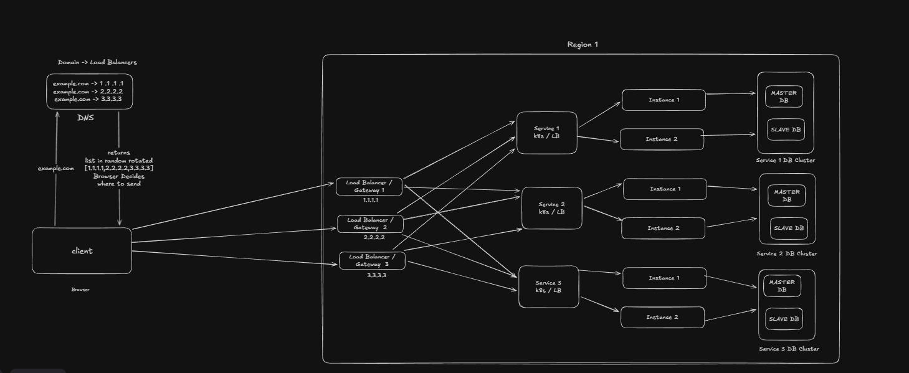

# 📘 Single-Region Scalable Architecture 

---

## 0️⃣ One-line intuition (lock this first)

> **DNS decides where you enter,
> Load Balancer decides which service,
> Kubernetes decides which instance,
> Service decides which database.**

If this line is clear, the whole diagram is clear.

---


## 1️⃣ WHAT this architecture is

This diagram represents a **production-grade, single-region architecture** where:

- traffic is highly available (no single point of failure)
- services scale horizontally
- databases are owned per service
- failures are isolated
- responsibilities are cleanly separated

Everything inside the box labeled **Region 1** lives in **one cloud region** (for example: AWS Mumbai, GCP Europe, etc.).


---

## 2️⃣ WHY this architecture exists

We want to solve these problems:

- Millions of users
- High traffic spikes
- Server failures
- Service crashes
- Database read pressure
- Zero coupling between infra routing and data ownership

The goal is **survivability, not perfection**.


---


## 3️⃣ DNS layer — what it does (and what it does NOT)

### What DNS does here

```
example.com
 → 1.1.1.1
 → 2.2.2.2
 → 3.3.3.3
```

DNS:

- returns a **list of IPs**
- may rotate the order
- client/browser picks one

### What DNS does NOT do

❌ DNS does NOT load balance requests
❌ DNS does NOT know server health in real time
❌ DNS does NOT route per request

> **DNS only provides entry-point redundancy.**

That’s it.

---

## 4️⃣ Load Balancers / Gateways — role clarity

You have **multiple Load Balancer / Gateway instances**:

```
LB / Gateway 1
LB / Gateway 2
LB / Gateway 3
```

Why multiple?

- To avoid LB being a SPOF
- If one dies, DNS/client hits another

These LBs:

- terminate TLS
- do basic routing (paths, headers)
- forward requests inward
- are **stateless**

They do **not**:

- decide database shards
- store user data
- keep session state

---

## 5️⃣ Services — the MOST important abstraction

### What “Service 1 / Service 2 / Service 3” means

Each **Service box** is a **logical service**, not a single server.

Think:

- Kubernetes Service
- ECS Service
- Internal load-balanced service

Example:

```
Service 1
 ├── Instance 1 (pod)
 └── Instance 2 (pod)
```

All instances:

- run the same code
- are stateless
- are interchangeable

> **Any request can go to any instance.**

This is intentional.

---

## 6️⃣ Kubernetes / internal LB — how instances connect

Important rule:

> **Pods never rely on localhost in production.**

In real production:

- pods run on different machines
- different IPs
- different failure zones

Kubernetes provides:

- a **virtual service IP**
- internal DNS
- automatic load balancing to pods

So traffic flow is:

```
Gateway → K8s Service → Pod (any instance)
```

You never manually route to instances.

---

## 7️⃣ Database ownership — the critical rule

### 🔒 Hard rule (never break this)

> **Each service owns exactly ONE database cluster.**

From the diagram:

```
Service 1 → Service 1 DB Cluster
Service 2 → Service 2 DB Cluster
Service 3 → Service 3 DB Cluster
```

No sharing.
No cross-service writes.
No “common DB”.

---

## 8️⃣ Database cluster — what Master / Slave means

Each service DB cluster has:

```
Primary (Master) → handles WRITES
Replica (Slave) → handles READS
```

All service instances connect to the **same DB cluster**.

Important clarification:

❌ Not:

```
Instance 1 → DB 1
Instance 2 → DB 2
```

✅ Correct:

```
Instance 1 ┐
Instance 2 ├──→ SAME DB CLUSTER
Instance 3 ┘
```

---

## 9️⃣ Read / Write logic — where it lives

Very important:

> **Load balancers do NOT decide database routing.**

The service does.

Inside service code (or DB proxy):

```
WRITE  → Primary DB
READ   → Replica DB
```

This keeps:

- infra simple
- data ownership explicit
- behavior deterministic

---

## 1️⃣0️⃣ Scaling behavior (sanity check)

### If traffic increases

- add more **LBs** → DNS already supports it
- add more **service instances** → k8s autoscaling
- add more **DB read replicas** → scale reads

No redesign needed.

---

## 1️⃣1️⃣ Failure behavior (important)

| Failure                   | What happens                 |
| ------------------------- | ---------------------------- |
| One LB dies               | Client hits another LB       |
| One service instance dies | k8s stops routing to it      |
| One DB replica dies       | reads go to other replica    |
| DB primary dies           | failover required (expected) |

This is **normal production reality**.

---

## 1️⃣2️⃣ What this architecture intentionally avoids

❌ Service-specific LBs
❌ LB between service and DB
❌ Stateful services
❌ Infra deciding data placement

If infra decides data, the design is wrong.

---

## 1️⃣3️⃣ Why this is ONLY one region

Everything here:

- LBs
- services
- DBs

live in **one region**.

There is:

- no geo routing yet
- no cross-region replication
- no global failover

This is intentional.

You must **perfect one region** before multi-region.

---

## 🔑 Final NDK Lock (burn this)

> **DNS chooses entry
> Gateway chooses service
> Kubernetes chooses instance
> Service chooses database
> Database holds truth**
