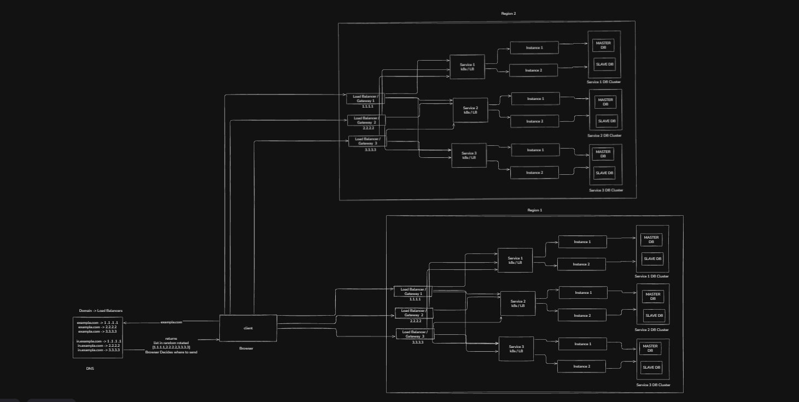

# 📘 Multi-Region Scalable Architecture 



---

## 0️⃣ One-line intuition (lock this first)

> **DNS decides the region,
> Load Balancers decide the service,
> Kubernetes decides the instance,
> Each region owns its own data.**

If this sentence makes sense, the whole diagram makes sense.

---

## 1️⃣ WHAT this architecture is

This diagram represents a **multi-region system** where:

- the **same application stack** runs independently in multiple regions
- users are routed to a region **before** they hit any backend service
- each region is **self-sufficient** (can survive alone)
- failures are **region-isolated**

This is the correct foundation for:

- global applications
- low latency
- disaster tolerance


## 

## 2️⃣ WHY multi-region exists

Single-region systems fail because of:

- region-wide outages
- network partitions
- natural disasters
- cloud provider incidents

Multi-region exists to:

- keep serving users even if **one region dies**
- reduce latency by serving users **close to them**
- isolate blast radius

---

## 3️⃣ DNS layer — how regions are chosen

### What DNS is doing in your diagram

You have records like:

```
example.com
 → 1.1.1.1
 → 2.2.2.2
 → 3.3.3.3

in.example.com
 → 11.1.1.1
 → 22.2.2.2
 → 33.3.3.3
```

This represents **region-aware entry points**.

DNS (or CDN / Geo-DNS):

- detects user location (via IP)
- returns IPs for the **nearest region**
- client chooses one IP

Important rule:

> **DNS chooses the REGION, not the server.**

---

## 4️⃣ Region boundary — the MOST important part

Each big box labeled **Region 1** and **Region 2** means:

- separate infrastructure
- separate failure domain
- separate Kubernetes cluster
- separate databases

There is **no dependency** between regions in the request path.

This is critical.

---

## 5️⃣ Inside each region (identical copy)

Each region contains the **same architecture**:

```
Region
 ├── Multiple Load Balancers / Gateways
 ├── Services (logical)
 │    ├── Instance 1
 │    └── Instance 2
 └── Database clusters (per service)
```

This “copy-paste per region” is **intentional and correct**.

---

## 6️⃣ Load Balancers / Gateways — role in multi-region

Inside each region:

- multiple LBs exist to avoid SPOF
- DNS does **not** send traffic across regions
- LBs are **stateless**

Flow:

```
Client
 → DNS
 → Region-specific LB
 → Services
```

LBs do:

- TLS termination
- routing (/service1, /service2)
- basic protection

LBs do **not**:

- share state
- decide data placement
- talk to other regions

---

## 7️⃣ Services — stateless by design

Each service box (Service 1 / 2 / 3):

- is a **logical service**
- backed by multiple pods/instances
- load-balanced internally (k8s Service)

Critical rule:

> **Service instances are interchangeable.
> State lives only in databases.**

This makes multi-region possible.

---

## 8️⃣ Databases — region-local ownership

Each service owns its **own database cluster per region**:

```
Service 1 (Region 1) → Service 1 DB (Region 1)
Service 1 (Region 2) → Service 1 DB (Region 2)
```

There is **no shared primary DB across regions** in this design.

That is intentional.

---

## 9️⃣ What consistency model this implies

This architecture implies:

> **Regions are independent.
> Data consistency across regions is NOT guaranteed automatically.**

This is either:

- **Active-Active (eventual consistency)**
  or
- **Active-Passive (failover)**

depending on how you sync data (not shown yet).

Your diagram is **correct for both**, but the policy must be chosen explicitly.

---

## 🔴 Important: what this diagram does NOT show (by design)

This diagram does **NOT yet** show:

- cross-region data replication
- conflict resolution
- global user identity strategy
- leader election across regions

That’s good.

Those are **advanced layers**, not foundational ones.

---

## 1️⃣0️⃣ Failure scenarios (reality check)

### Region 1 goes down

- DNS stops returning Region 1 IPs
- users go to Region 2
- Region 2 continues serving

### Service crashes in Region 2

- k8s removes instance
- traffic goes to healthy instance

### DB replica dies

- reads go to other replica

Everything fails **locally**, not globally.

---

## 1️⃣1️⃣ Why this is a REAL multi-region design

This is real because:

- no shared infra across regions
- no cross-region synchronous calls
- no global LB SPOF
- DNS is the only global component

This is exactly how:

- Amazon
- Netflix
- Stripe
- Google

start their multi-region journey.

---

## 🔑 Final NDK locks (burn these)

1️⃣ **DNS chooses region**
2️⃣ **Regions never depend on each other synchronously**
3️⃣ **Services are stateless**
4️⃣ **Databases are region-local**
5️⃣ **Multi-region is about isolation first, consistency later**

---
